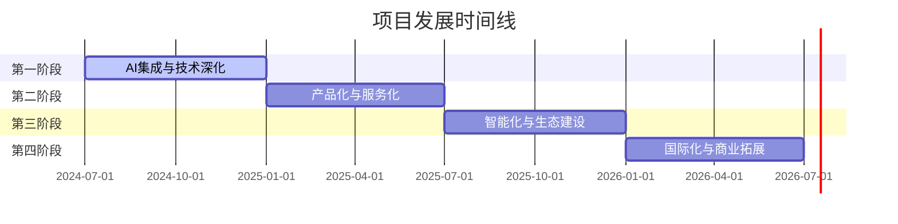

# 🗺️ AI驱动软件著作权申请材料生成系统 - 项目路线图

## 📋 当前功能特性 (v1.0 - 已完成)

### ✅ 核心功能
- **完整工作流程**：六阶段软著材料生成流程
- **AI提示词体系**：七个专业AI系统提示词
- **多UI设计风格**：企业商务、暗黑科技、极简主义三种风格
- **智能风格选择**：项目初始化时交互式UI风格选择
- **自动化脚本**：前后端源代码文档生成脚本
- **项目初始化**：`init_project.py` 支持快速项目创建
- **配置管理**：`config.json` 参数化项目配置
- **完整文档体系**：中英文双语文档和使用指南

### ✅ 技术架构
- **模板化设计**：规范文档和技术栈模板
- **跨平台支持**：Python和Shell双重脚本
- **版本控制友好**：规范的.gitignore和Git工作流
- **开源生态**：MIT许可证，GitHub托管

## 🚀 未来发展路线图

### 第一阶段：AI集成与技术深化 (v2.0) - 3-6个月

#### 🎯 主要目标：解决用户痛点，提升自动化程度

#### 🔥 高优先级功能

**AI服务深度集成**
- [ ] **OpenAI API集成**：支持GPT-4、GPT-3.5 Turbo API调用
- [ ] **Claude API集成**：集成Anthropic Claude API
- [ ] **OpenRouter/SilliconFlow API集成**：集成 OpenRouter/SilliconFlow 等模型提供商 API
- [ ] **国产AI支持**：文心一言、通义千问、ChatGLM API
- [ ] **本地AI支持**：Ollama、LocalAI等本地部署方案
- [ ] **一键生成**：从需求文档到完整材料包的全自动生成
- [ ] **批量处理**：支持多项目批量生成

**技术栈大幅扩展**
- [ ] **前端技术栈**：
  - React (18+) + TypeScript + Vite
  - Vue 3 + Composition API + TypeScript
  - Angular 16+ + TypeScript
  - Flutter 3.x (移动端)
- [ ] **后端技术栈**：
  - Python (Django 4+, FastAPI)
  - Node.js (Express, NestJS)
  - Go (Gin, Echo)
  - Java (Spring Boot 3+)
- [ ] **数据库支持**：
  - 关系型数据库：MySQL 8+, PostgreSQL 15+
  - NoSQL：MongoDB, Redis
  - 云数据库：AWS RDS, Azure SQL

**用户体验优化**
- [ ] **进度可视化**：生成过程的实时进度展示
- [ ] **错误处理**：智能错误检测和修复建议
- [ ] **模板预览**：生成前的模板预览功能
- [ ] **增量更新**：支持项目配置变更后的增量生成

**Word文档格式生成**
- [ ] **Word模板引擎**：集成python-docx或类似库实现Word文档生成
- [ ] **专业模板库**：预置符合软著申请要求的Word模板
- [ ] **格式化输出**：
  - 技术文档Word版本（含目录、页眉页脚、样式）
  - 用户手册Word版本（含图表、截图占位符）
  - 软著申请表Word版本（标准格式、可直接提交）
- [ ] **批量导出**：一键导出所有材料为Word格式
- [ ] **自定义样式**：支持用户自定义Word模板样式
- [ ] **PDF转换**：Word文档自动转换为PDF格式

#### ⭐ 中优先级功能

**代码质量与工程化**
- [ ] **代码规范集成**：ESLint, Prettier, SonarQube
- [ ] **自动化测试**：单元测试、集成测试生成
- [ ] **CI/CD模板**：GitHub Actions, GitLab CI
- [ ] **Docker支持**：容器化部署配置
- [ ] **API文档生成**：Swagger/OpenAPI 3.0
- [ ] **性能优化**：代码分割、懒加载模板

**配置系统增强**
- [ ] **高级配置**：更精细的项目配置选项
- [ ] **环境管理**：开发、测试、生产环境配置
- [ ] **插件系统基础**：为后续插件生态做准备

#### 🎯 交付目标
- **完全自动化**：用户可实现真正的一键生成，无需手动复制粘贴
- **专业文档输出**：直接生成符合软著申请要求的Word格式文档
- **技术栈覆盖**：支持主流技术栈的90%覆盖
- **用户体验优秀**：提供直观的进度反馈和错误处理机制

---

### 第二阶段：产品化与服务化 (v3.0) - 6-12个月

#### 🎯 主要目标：从工具向产品转变，扩大用户群体

#### 🔥 高优先级功能

**Web服务平台**
- [ ] **Web界面**：React/Vue构建的现代化Web界面
- [ ] **用户系统**：注册、登录、用户管理
- [ ] **项目管理**：在线项目创建、编辑、管理
- [ ] **实时预览**：所见即所得的材料预览
- [ ] **云端存储**：项目文件的云端同步和备份
- [ ] **高级导出功能**：增强的多格式导出（Excel报表、压缩包打包、邮件发送）

**行业特化模板**
- [ ] **金融科技模板**：
  - 支付系统、区块链应用
  - 风控系统、量化交易平台
- [ ] **教育科技模板**：
  - 在线学习平台、LMS系统
  - 教务管理、知识付费平台
- [ ] **医疗健康模板**：
  - 医院信息系统、HIS/EMR
  - 健康管理、远程医疗平台
- [ ] **电商零售模板**：
  - 电商平台、供应链管理
  - 新零售、O2O平台
- [ ] **物联网模板**：
  - 智能硬件控制系统
  - 工业物联网、智慧城市

**协作与团队功能**
- [ ] **团队协作**：多人协作编辑项目
- [ ] **权限管理**：细粒度的访问权限控制
- [ ] **版本管理**：项目版本历史和回滚
- [ ] **评论系统**：团队内部的讨论和反馈

#### ⭐ 中优先级功能

**企业级功能**
- [ ] **私有部署**：企业内网部署方案
- [ ] **SSO集成**：企业单点登录支持
- [ ] **审批流程**：企业内部审批工作流
- [ ] **批量操作**：企业级批量项目管理

**API与集成**
- [ ] **RESTful API**：完整的后端API服务
- [ ] **Webhook支持**：事件驱动的集成能力
- [ ] **第三方集成**：与现有工具链集成

#### 🎯 交付目标
- 从CLI工具转变为完整的Web产品
- 覆盖5个主要垂直行业
- 支持企业级用户的协作需求

---

### 第三阶段：智能化与生态建设 (v4.0) - 12-18个月

#### 🎯 主要目标：AI深度应用，构建开放生态

#### 🔥 高优先级功能

**AI智能化升级**
- [ ] **智能项目分析**：
  - 基于现有代码自动生成需求文档
  - 技术栈自动识别和建议
  - 架构模式智能推荐
- [ ] **相似性检测**：
  - 与已有软著的相似性分析
  - 重复风险预警和建议
- [ ] **成功率预测**：
  - 基于历史数据的申请成功率预测
  - 申请策略优化建议
- [ ] **智能优化**：
  - 基于用户反馈的自动优化
  - 提示词动态调优

**开放生态系统**
- [ ] **插件架构**：
  - 标准化插件API
  - 插件开发工具包(SDK)
  - 插件市场和分发机制
- [ ] **模板市场**：
  - 用户贡献模板平台
  - 模板评级和推荐系统
  - 付费优质模板支持
- [ ] **开发者平台**：
  - 开放API文档和SDK
  - 开发者社区和论坛
  - 技术支持和培训

#### ⭐ 中优先级功能

**高级AI功能**
- [ ] **多模态理解**：支持图片、文档等多种输入
- [ ] **知识图谱**：软著领域的知识库构建
- [ ] **自然语言交互**：对话式项目配置和生成

**数据分析与洞察**
- [ ] **使用分析**：用户行为和使用模式分析
- [ ] **成功率统计**：各行业、技术栈的成功率统计
- [ ] **趋势预测**：技术发展趋势和申请趋势分析

#### 🎯 交付目标
- AI能力达到行业领先水平
- 构建活跃的开发者生态
- 积累丰富的行业数据和洞察

---

### 第四阶段：国际化与商业拓展 (v5.0) - 18-24个月

#### 🎯 主要目标：全球化扩展，商业模式成熟

#### 🔥 高优先级功能

**国际化扩展**
- [ ] **多国标准支持**：
  - 美国版权申请（USCO）
  - 欧盟知识产权（EUIPO）
  - 日本特许厅（JPO）
  - 其他主要国家标准
- [ ] **多语言界面**：
  - 英文、日文、韩文、德文
  - 本地化UI和文档
- [ ] **本土化适配**：
  - 各国法律要求定制
  - 本地化申请流程
  - 文化适应性调整

**商业服务体系**
- [ ] **专业咨询服务**：
  - 软著申请策略咨询
  - 知识产权保护规划
  - 技术架构优化建议
- [ ] **代理申请服务**：
  - 与知识产权代理机构合作
  - 一站式申请代理服务
- [ ] **企业定制服务**：
  - 大型企业定制解决方案
  - 私有化部署和定制开发
  - 专属技术支持

#### ⭐ 中优先级功能

**高级商业功能**
- [ ] **SaaS订阅模式**：多层级订阅服务
- [ ] **企业版功能**：高级企业功能包
- [ ] **合作伙伴计划**：渠道合作和分润体系

#### 🎯 交付目标
- 进入国际市场，覆盖主要发达国家
- 建立成熟的商业服务体系
- 实现可持续的商业模式

---

## 📊 版本发布计划

### 里程碑时间表

### 版本发布节奏
- **Major版本**：每6个月发布一个主要版本
- **Minor版本**：每2个月发布功能更新
- **Patch版本**：每周发布bug修复和小改进

## 🎯 关键成功指标 (KPIs)

### 技术指标
- **生成质量**：生成代码的可运行率 > 95%
- **覆盖率**：技术栈覆盖率 > 90%
- **性能**：完整材料生成时间 < 5分钟
- **稳定性**：系统可用性 > 99.9%

### 用户指标
- **用户增长**：月活跃用户数增长率 > 20%
- **用户满意度**：NPS评分 > 50
- **留存率**：30天用户留存率 > 60%
- **转化率**：免费用户到付费用户转化率 > 5%

### 商业指标
- **收入增长**：年度收入增长率 > 100%
- **市场份额**：在软著申请工具市场占有率 > 10%
- **客户价值**：企业客户年度价值 > $10,000

## 🤝 贡献指南

### 开发贡献
- **代码贡献**：遵循代码规范，提交PR
- **文档改进**：完善文档和使用指南
- **Bug报告**：GitHub Issues提交问题
- **功能建议**：GitHub Discussions参与讨论

### 社区建设
- **用户反馈**：收集和响应用户需求
- **案例分享**：分享成功使用案例
- **技术交流**：定期技术分享和交流

## 📞 联系方式

- **GitHub Repository**: https://github.com/flanliulf/AI-Copyright-Application-Generator
- **Issues & Bug Reports**: GitHub Issues
- **Feature Requests**: GitHub Discussions
- **Documentation**: 项目README和文档目录

---

*本路线图将根据用户反馈、技术发展和市场需求持续更新*

**最后更新**: 2024年6月
**下次评估**: 2024年9月