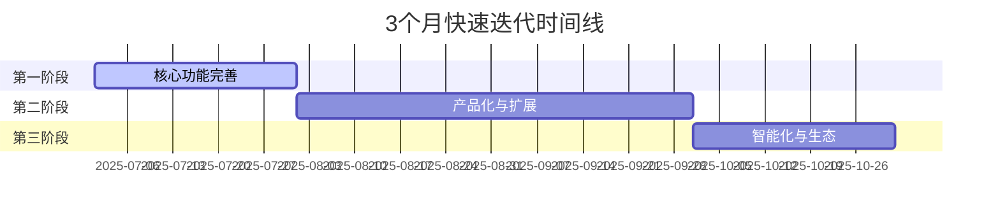

# 🗺️ AI驱动软件著作权申请材料生成系统 - 项目路线图

## 📋 当前功能特性 (v1.0 - 已完成)

### ✅ 核心功能
- **完整工作流程**：六阶段软著材料生成流程
- **AI提示词体系**：七个专业AI系统提示词
- **多UI设计风格**：企业商务、暗黑科技、极简主义三种风格
- **智能风格选择**：项目初始化时交互式UI风格选择
- **自动化脚本**：前后端源代码文档生成脚本
- **项目初始化**：`init_project.py` 支持快速项目创建
- **配置管理**：`ai-copyright-config.json` 参数化项目配置
- **完整文档体系**：中英文双语文档和使用指南

### ✅ 技术架构
- **模板化设计**：规范文档和技术栈模板
- **跨平台支持**：Python和Shell双重脚本
- **版本控制友好**：规范的.gitignore和Git工作流
- **开源生态**：MIT许可证，GitHub托管

## 🚀 未来发展路线图（3个月快速迭代）

### 第一阶段：核心功能完善 (v2.0) - 1个月内 (2025年7月)

#### 🎯 主要目标：解决用户核心痛点，实现真正可用的产品

#### 🔥 高优先级功能

**AI服务集成（MVP）**
- [ ] **DeepSeek API集成**：集成 DeepSeek R1、DeepSeek V3 Coder
- [ ] **一键生成**：从需求文档到完整材料包的全自动生成
- [ ] **错误处理**：基础的错误检测和重试机制

**Word文档格式生成（核心刚需）**
- [ ] **Word模板引擎**：集成python-docx实现Word文档生成
- [ ] **核心模板**：软著申请必需的3个Word模板
  - 技术文档Word版本
  - 用户手册Word版本  
  - 软著申请表Word版本
- [ ] **一键导出**：生成所有Word格式材料

**关键技术栈支持**
- [ ] **React支持**：最流行的前端框架
- [ ] **Python后端**：Django/FastAPI基础支持
- [ ] **MySQL支持**：最常用的数据库

#### 🎯 第一阶段交付目标
- **真正可用**：用户可以一键生成完整软著申请材料包
- **专业输出**：直接生成Word格式，无需手动调整
- **AI驱动**：全程AI自动化，解放用户双手
- **核心覆盖**：支持80%用户的主要技术栈需求

---

### 第二阶段：产品化与扩展 (v3.0) - 2-3个月 (2025年8-9月)

#### 🎯 主要目标：Web产品化，扩展技术栈覆盖

#### 🔥 高优先级功能

**Web产品化（简化版）**
- [ ] **Web界面**：简洁的单页面应用
- [ ] **在线生成**：浏览器端项目创建和生成
- [ ] **实时预览**：生成过程可视化
- [ ] **结果下载**：生成结果直接下载

**技术栈扩展**
- [ ] **Vue/Angular支持**：扩展前端框架支持
- [ ] **Node.js后端**：Express/NestJS支持
- [ ] **Go语言支持**：Gin框架支持
- [ ] **更多数据库**：PostgreSQL、MongoDB支持

**热门行业模板**
- [ ] **电商平台模板**：最热门的应用场景
- [ ] **管理系统模板**：企业级应用模板
- [ ] **小程序模板**：微信小程序/支付宝小程序

#### 🎯 第二阶段交付目标
- **Web产品化**：提供在线服务，降低使用门槛
- **技术栈全覆盖**：支持90%的主流技术组合
- **行业化模板**：覆盖最热门的3个垂直领域

---

### 第三阶段：智能化与生态优化 (v4.0) - 3个月以上 (2025年10月及以后)

#### 🎯 主要目标：AI智能升级，生态初步建设

#### 🔥 高优先级功能

**AI智能化升级（简化版）**
- [ ] **多AI模型支持**：Claude、通义千问、OpenAI等2-3个主流AI模型
- [ ] **智能质量检查**：基础的生成内容质量评估
- [ ] **用户反馈收集**：收集真实用户使用反馈和改进建议

**基础商业化功能**
- [ ] **使用统计**：基础的使用量统计和分析
- [ ] **用户反馈系统**：完善的问题反馈和建议收集机制
- [ ] **付费模式探索**：初步的商业模式验证（如高级模板）

**生态基础建设**
- [ ] **社区初建**：GitHub Discussions、用户交流群
- [ ] **案例展示**：收集和展示成功申请案例
- [ ] **开发者文档**：完善的API文档和扩展指南

#### ⭐ 中优先级功能

**用户体验优化**
- [ ] **批量处理**：支持一次性处理多个项目
- [ ] **模板库扩展**：增加更多行业特定模板
- [ ] **错误诊断**：智能错误诊断和修复建议

#### 🎯 第三阶段交付目标
- **AI能力提升**：支持多种AI模型，提升生成质量
- **商业模式验证**：初步验证可行的商业模式
- **社区基础**：建立活跃的用户社区和反馈机制
- **生态雏形**：形成基本的开发者生态

---

## 📊 版本发布计划

### 里程碑时间表

### 版本发布节奏（快速迭代）
- **Major版本**：每1个月发布一个主要版本
- **Minor版本**：每1周发布功能更新
- **Patch版本**：每2-3天发布bug修复和小改进

## 🎯 关键成功指标 (KPIs) - 3个月目标

### 技术指标（3个月内）
- **生成质量**：生成代码的可运行率 > 85%（第1阶段达成）
- **覆盖率**：技术栈覆盖率 > 70%（第2阶段达成）
- **性能**：完整材料生成时间 < 15分钟（第1阶段达成）
- **Word文档生成**：一键生成Word格式成功率 > 90%（第1阶段核心指标）

### 用户指标（3个月内）
- **用户增长**：累计用户数 > 500（第2阶段达成）
- **用户反馈**：获得有效用户反馈 > 100条（持续收集）
- **GitHub Stars**：GitHub项目获得Stars > 200（第2阶段达成）
- **成功案例**：收集软著申请成功案例 > 20个（第3阶段达成）

### 产品指标（3个月内）
- **功能完整性**：核心功能100%可用（第1阶段达成）
- **UI风格支持**：三种UI风格全面支持（已完成）
- **技术栈支持**：支持主流技术栈组合 > 6种（第2阶段达成）
- **文档质量**：用户文档完整性和清晰度 > 85%（持续优化）

## 🤝 贡献指南

### 开发贡献
- **代码贡献**：遵循代码规范，提交PR
- **文档改进**：完善文档和使用指南
- **Bug报告**：GitHub Issues提交问题
- **功能建议**：GitHub Discussions参与讨论

### 社区建设
- **用户反馈**：收集和响应用户需求
- **案例分享**：分享成功使用案例
- **技术交流**：定期技术分享和交流

## 📞 联系方式

- **GitHub Repository**: https://github.com/flanliulf/AI-Copyright-Application-Generator
- **Issues & Bug Reports**: GitHub Issues
- **Feature Requests**: GitHub Discussions
- **Documentation**: 项目README和文档目录

---

## 📋 路线图压缩说明

### 压缩策略
- **时间压缩**：将发展周期压缩到3个月，专注MVP和核心价值
- **功能简化**：移除复杂的高级功能，专注解决用户核心痛点
- **快速迭代**：每1个月一个主要版本，快速验证和调整
- **用户导向**：优先解决Word文档生成、AI集成等刚需功能
- **AI模型优化**：优先集成DeepSeek API，降低成本提升中文支持

### 技术选型优化
- **第一阶段**：DeepSeek V2、DeepSeek Coder优先集成（成本低、中文支持好）
- **第三阶段**：扩展支持Claude、通义千问、OpenAI等主流模型
- **配置灵活性**：项目初始化支持多目录创建和全局命令配置

### 成功标准
经过3个月快速迭代后，项目应该：
1. **真正可用**：用户可以一键生成完整的软著申请材料包
2. **口碑良好**：获得500+用户和200+ GitHub Stars
3. **商业验证**：初步验证可行的商业模式
4. **技术领先**：在AI驱动的软著申请工具领域确立优势地位

---

*本路线图采用快速迭代策略，将根据用户反馈和市场验证持续调整*

**最后更新**: 2025年6月24日
**下次评估**: 2025年7月24日（快速迭代，缩短评估周期）